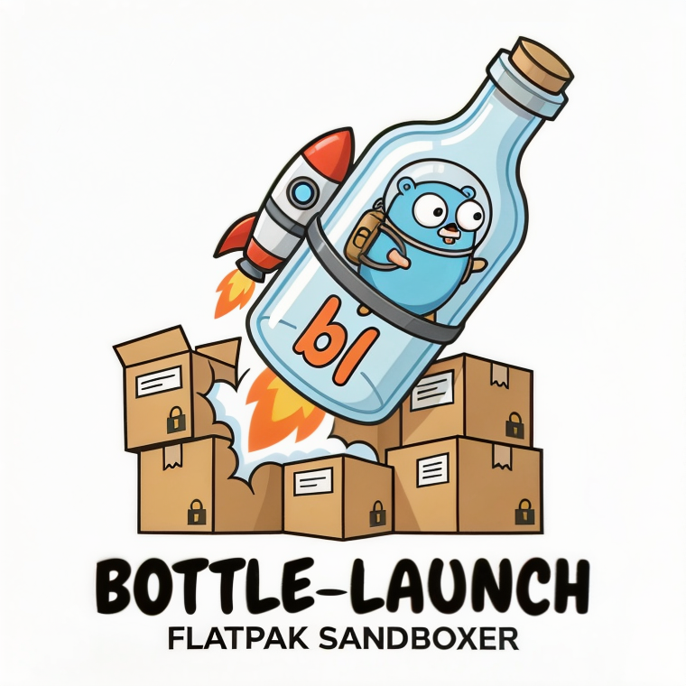

# bottle-launch

<p align="center">
  
</p>

[](LICENSE)
[](https://go.dev/)

A TUI/CLI application for launching Flatpak applications with data stored in encrypted LUKS2 containers ("bottles"). Keep your app data isolated and encrypted, unlockable with a password or FIDO2/YubiKey.

## Features

- Create encrypted containers (bottles) for Flatpak app data
- Password or YubiKey/FIDO2 authentication
- Interactive TUI for easy management
- CLI mode for scripting and automation
- Configurable sandbox permissions per bottle
- Automatic cleanup on exit

## System Requirements

- **Linux** with systemd (for udisks2)
- **Go 1.22+** (for building)
- **udisks2** - for mounting/unmounting encrypted volumes
- **cryptsetup** - for LUKS2 encryption
- **flatpak** - for running sandboxed applications
- **libfido2** (optional) - for YubiKey/FIDO2 support

### Installing Dependencies

**Arch Linux:**
```bash
sudo pacman -S udisks2 cryptsetup flatpak libfido2
```

**Fedora:**
```bash
sudo dnf install udisks2 cryptsetup flatpak libfido2
```

**Ubuntu/Debian:**
```bash
sudo apt install udisks2 cryptsetup flatpak libfido2-1
```

## Installation

```bash
# Clone the repository
git clone https://github.com/neoromantique/bottle-launch
cd bottle-launch

# Build
make build

# Install (optional)
sudo cp bottle-launch /usr/local/bin/
```

## Usage

### TUI Mode (default)

Simply run `bottle-launch` to start the interactive interface:

```bash
bottle-launch
```

Navigate with arrow keys or vim-style `j`/`k`, select with Enter, and press `q` to quit.

### CLI Mode

```bash
# Create a new 2GB encrypted bottle
bottle-launch create passwords.bottle 2G

# Run KeePassXC with data in an encrypted bottle
bottle-launch run passwords.bottle org.keepassxc.KeePassXC

# Run Obsidian with notes stored in an encrypted bottle
bottle-launch run notes.bottle md.obsidian.Obsidian

# Pass extra arguments to the app
bottle-launch run browser.bottle org.mozilla.firefox -- --private-window

# List mounted bottles
bottle-launch list
```

### Example Workflow

1. **Create a bottle for your password manager:**
   ```bash
   bottle-launch create passwords.bottle 500M
   ```
   Enter a strong password when prompted.

2. **Launch KeePassXC with data in the bottle:**
   ```bash
   bottle-launch run passwords.bottle org.keepassxc.KeePassXC
   ```
   Your KeePassXC database lives inside the encrypted container.

3. **Create a YubiKey-protected bottle for notes:**

   Use the TUI (`bottle-launch`) and press `y` to create a YubiKey bottle. Touch your YubiKey when prompted.

4. **Launch Obsidian with encrypted notes:**
   ```bash
   bottle-launch run notes.bottle md.obsidian.Obsidian
   ```

## Permissions

Each bottle has configurable sandbox permissions:

| Permission | Description |
|------------|-------------|
| Network    | Allow network access |
| Audio      | Allow audio playback/recording |
| GPU        | Allow GPU acceleration |
| Wayland    | Allow Wayland display |
| X11        | Allow X11 display (fallback) |
| Camera     | Allow camera access |
| Portals    | Allow portal access (file chooser, notifications) |

Edit permissions in the TUI or modify the config file at `~/.config/bottle-launch/<hash>.conf`.

## Storage Locations

- **Bottles:** `~/.local/share/bottles/` (or `$BOTTLE_DIR`)
- **Configs:** `~/.config/bottle-launch/`

## Known Limitations

- Camera device is currently hardcoded to `/dev/video0`
- No concurrent multi-bottle support (one app per bottle at a time)
- Requires polkit/sudo for LUKS operations

## Security Notes

- Bottles use LUKS2 encryption with strong defaults
- YubiKey bottles use FIDO2 hmac-secret extension
- **WARNING:** Losing a YubiKey means permanent data loss for YubiKey-protected bottles
- Config files contain FIDO2 credential IDs (not secrets) - back them up!

## Project Structure

```
bottle-launch/
├── src/           # Go source code
├── Makefile       # Build commands
├── logo.png
└── README.md
```

## Contributing

See [CONTRIBUTING.md](CONTRIBUTING.md) for guidelines.

## License

MIT License with "do no evil" clause - see [LICENSE](LICENSE) for details.
